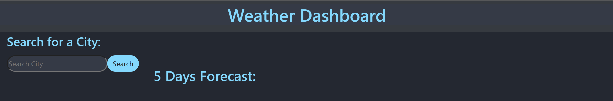
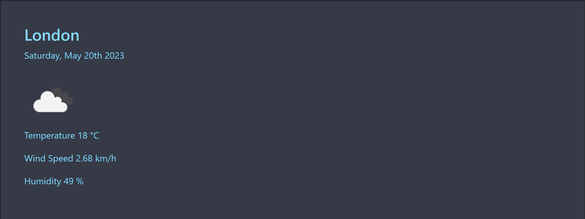
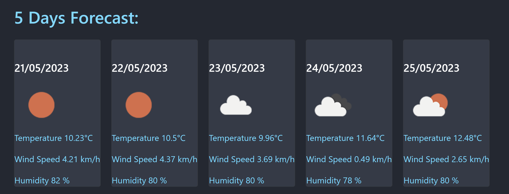
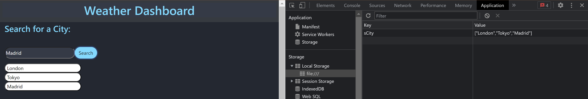

# Weather-Forecast-Dashboard

## Description

"Weather Forecast Dashboard" is an app, that allows the user to see the weather forecast for cities of their choosing.The app uses Server APIs,which retrieving data from another application's API - OpenWeatherMap APIs.

## Installation

Follow the link for the deployed website [Weather-Dashboard](https://milla56.github.io/Weather-Forecast-Dashboard/) 

## User Story 
AS A traveler
I WANT to see the weather outlook for multiple cities
SO THAT I can plan a trip accordingly

## Usage
The list shows what steps were made to complete the challenge:
 - Once the Weather Dashboard is opened, the user is able to see a search bar where the city name can be typed.
 
- When the city of choice is logged, the user is presented with :
  * the name of the city
  * current date
  * an icon representing the weather conditions
  * city's temperature in Celsius
  * city's wind speed in km/h (Kilometre per hour)  
  * city's humidity in percent (%)

- When the user chooses the city and the current weather is displayed, the app dispalys a 5-day forecast,which includes:
  * the date
  * an icon of the weather conditions
  * temperature
  * humidity
  * wind speed

- When the user clicks on a city, which is located in the search history, the user will be presented again with the current weather and with 5-day forecast.

- All of the searched city will appear in the local storage.

## Technologies Used
- HTML5
- CSS3
- JavaScript
- jQuery
- Open Weather Map API
- Moment.js
- Bootstrap

## Credits

N/A

## License
milla56/Weather-Forecast-Dashboard is licensed under the
MIT License
A short and simple permissive license with conditions only requiring preservation of copyright and license notices. Licensed works, modifications, and larger works may be distributed under different terms and without source code.

